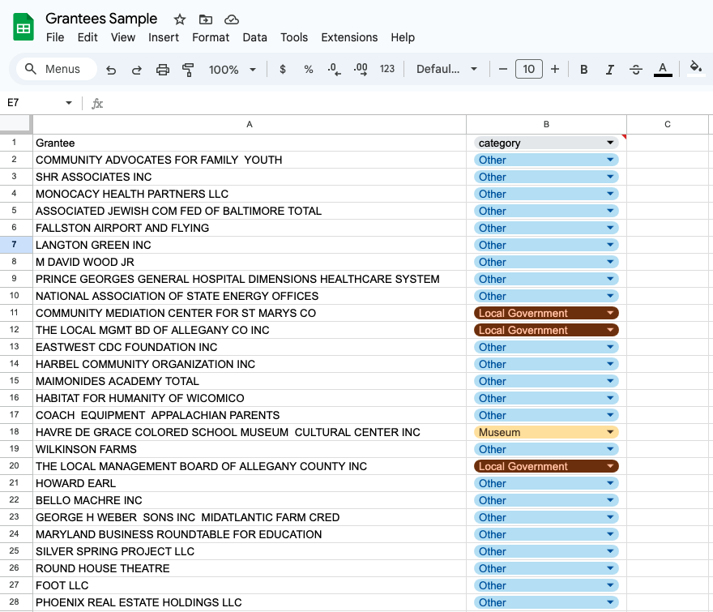

# Evaluating prompts

Before the advent of large-language models, machine-learning systems were trained using a technique called [supervised learning](https://en.wikipedia.org/wiki/Supervised_learning). This approach required users to provide carefully prepared training data that showed the computer what was expected.

For instance, if you were developing a model to distinguish spam emails from legitimate ones, you would need to provide the model with a set of spam emails and another set of legitimate emails. The model would then use that data to learn the relationships between the inputs and outputs, which it could then apply to new emails.

In addition to training the model, the curated input would be used to evaluate the model's performance. This process typically involved splitting the supervised data into two sets: one for training and one for testing. The model could then be evaluated using a separate set of supervised data to ensure it could generalize beyond the examples it had been fed during training.

Large-language models operate differently. They are trained on vast amounts of text and can generate responses based on the relationships they derive from various machine-learning approaches. The result is that they can be used to perform a wide range of tasks without requiring supervised data to be prepared beforehand.

This is a significant advantage. However, it also raises questions about evaluating an LLM prompt. If we don’t have a supervised sample to test its results, how do we know if it’s doing a good job? How can we improve its performance if we can’t see where it gets things wrong?

In the final chapters, we will show how traditional supervision can still play a vital role in evaluating and improving an LLM prompt.

Start by outputting a random sample from the dataset to a file of comma-separated values. It will serve as our supervised sample. In general, the larger the sample the better the evaluation. But at a certain point the returns diminish. For this exercise, we will use a sample of 250 records.

```python
df.sample(250).to_csv("./sample.csv", index=False)
```

You can open the file in a spreadsheet program like Excel or Google Sheets. For each payee in the sample, you would provide the correct category in a companion column. This gradually becomes the supervised sample.



To speed the class along, we've already prepared a sample for you in [the class repository](https://github.com/NewsAppsUMD/first-llm-classifier). Our next step is to read it back into a DataFrame. Let's create a new file called `eval.py` for this work:

```bash
touch eval.py
```

And copy the first 8 lines from your `classifier_umd.py` file, then add this:

```python
sample_df = pd.read_csv("https://raw.githubusercontent.com/NewsAppsUMD/first-llm-classifier-umd/refs/heads/main/sample.csv")
```

We'll install the Python packages `scikit-learn`, `matplotlib`, and `seaborn`. Prior to LLMs, these libraries were the go-to tools for training and evaluating machine-learning models. We'll primarily be using them for testing.

Return to the terminal and install the packages alongside our other dependencies.

```
pip install scikit-learn matplotlib seaborn
```

Add the `test_train_split` function from `scikit-learn` to the import statement.

{emphasize-lines="6"}
```python
import os
import json
from groq import Groq
from retry import retry
import pandas as pd
from sklearn.model_selection import train_test_split
```

This tool is used to split a supervised sample into separate sets for training and testing.

The first input is the DataFrame column containing our supervised payees. The second input is the DataFrame column containing the correct categories.

The `test_size` parameter determines the proportion of the sample that will be used for testing. The `random_state` parameter ensures that the split is reproducible by setting a seed for the random number generator that draws the samples.

```python
training_input, test_input, training_output, test_output = train_test_split(
    sample_df[['Grantee']],
    sample_df['category'],
    test_size=0.33,
    random_state=42, # Remember Jackie Robinson. Remember Douglas Adams.
)
```

In a traditional training setup, the next step would be to train a machine-learning model in `sklearn` using the `training_input` and `training_output` sets. The model would then be evaluated using the `test_input` and `test_output` sets.

With the LLM we skip ahead to the testing phase. We pass the `test_input` set to our LLM prompt and compare the results to the right answers found in `test_output` set.

All that requires is that we pass the `Grantee` column from our `test_input` DataFrame to the function we created in the previous chapters. We'll need to import that function:

```python
from classifier_umd import classify_batches
```

And then add this to the bottom of our new script:

```python
llm_df = classify_batches(list(test_input.Grantee))
```

Next, we import the `classification_report` and `confusion_matrix` functions from `sklearn`, which are used to evaluate a model's performance. We'll also pull in `seaborn` and `matplotlib` to visualize the results.

{emphasize-lines="6-7,10"}
```python
import os
import json
from groq import Groq
from retry import retry
import pandas as pd
import seaborn as sns
import matplotlib.pyplot as plt
from sklearn.model_selection import train_test_split
from classifier_umd import classify_batches
from sklearn.metrics import confusion_matrix, classification_report
```

The `classification_report` function generats a report card on a model's performance. You provide it with the correct answers in the `test_output` set and the model's predictions in your prompt's DataFrame. In this case, our LLM's predictions are stored in the `llm_df` DataFrame's `category` column.

```python
print(classification_report(test_output, llm_df.category))
```

That will output a report that looks something like this:

```
                  precision    recall  f1-score   support

Higher Education       0.75      1.00      0.86         3
Local Government       0.82      1.00      0.90         9
          Museum       1.00      1.00      1.00         2
           Other       1.00      0.96      0.98        69

        accuracy                           0.96        83
       macro avg       0.89      0.99      0.93        83
    weighted avg       0.97      0.96      0.97        83
```

At first, the report can be a bit overwhelming. What are all these technical terms?

Precision measures what statistics nerds call "positive predictive value." It's how often the model made the correct decision when it applied a category. For instance, in the "Museum" category, the LLM correctly predicted both of the museums in our supervised sample. That's a precision of 1.00. An analogy here is a baseball player's contact rate. Precision is a measure of how often the model connects with the ball when it swings its bat.

Recall measures how many of the supervised instances were identified by the model. In this case, it shows that the LLM correctly spotted 100% of the local government agencies in our manual sample.

The f1-score is a combination of precision and recall. It's a way to measure a model's overall performance by balancing the two.

The support column shows how many instances of each category were in the supervised sample.

The averages at the bottom combine the results for all categories. The macro row is a simple average all the scores in that column. The weighted row is a weighted average based on the number of instances in each category.

In the example result provided above, we can see that the LLM was guessing correctly more than 90% of the time no matter how you slice it.

Due to the inherent randomness in the LLM's predictions, it's a good idea to test your sample and run these reports multiple times to get a sense of the model's performance. 

Before we look at how you might improve the LLM's performance, let's take a moment to compare the results of this evaluation against the old school approach where the supervised sample is used to train a machine-learning model that doesn't have access to the ocean of knowledge poured into an LLM.

This will require importing a mess of `sklearn` functions and classes. We'll use `TfidfVectorizer` to convert the payee text into a numerical representation that can be used by a `LinearSVC` classifier. We'll then use a `Pipeline` to chain the two together. If you have no idea what any of that means, don't worry. Now that we have LLMs in this world, you might never need to know.


{emphasize-lines="12-15"}
```python
import os
import json
from rich import print
from groq import Groq
from retry import retry
import pandas as pd
import seaborn as sns
import matplotlib.pyplot as plt
from sklearn.model_selection import train_test_split
from sklearn.metrics import confusion_matrix, classification_report
from classifier_umd import classify_batches
from sklearn.svm import LinearSVC
from sklearn.pipeline import Pipeline
from sklearn.compose import ColumnTransformer
from sklearn.feature_extraction.text import TfidfVectorizer
```

Here's a simple example of how you might train and evaluate a traditional machine-learning model using the supervised sample.

First you setup all the machinery.

```python
vectorizer = TfidfVectorizer(
    sublinear_tf=True,
    min_df=5,
    norm='l2',
    encoding='latin-1',
    ngram_range=(1, 3),
)
preprocessor = ColumnTransformer(
    transformers=[
        ('Grantee', vectorizer, 'Grantee')
    ],
    sparse_threshold=0,
    remainder='drop'
)
pipeline = Pipeline([
    ('preprocessor', preprocessor),
    ('classifier', LinearSVC(dual="auto"))
])
```

Then you train the model using those training sets we split out at the start.

```python
model = pipeline.fit(training_input, training_output)
```

And you ask the model to use its training to predict the right answers for the test set.

```python
predictions = model.predict(test_input)
```

Now, you can run the same evaluation code as before to see how the traditional model performed.

```python
print(classification_report(test_output, predictions))
```

```
                  precision    recall  f1-score   support

Higher Education       0.00      0.00      0.00         3
Local Government       0.71      0.56      0.62         9
          Museum       0.00      0.00      0.00         2
           Other       0.88      0.97      0.92        69

        accuracy                           0.87        83
       macro avg       0.40      0.38      0.39        83
    weighted avg       0.81      0.87      0.84        83
```

Not great. The traditional model is guessing correctly about 87% of the time, but it's missing most cases of our "Higher Education", "Museum" and "Local Government" categories as almost everything is getting filed as "Other." The LLM, on the other hand, is guessing correctly more than 90% of the time and flagging many of the rare categories that we're seeking to find in the haystack of data.
